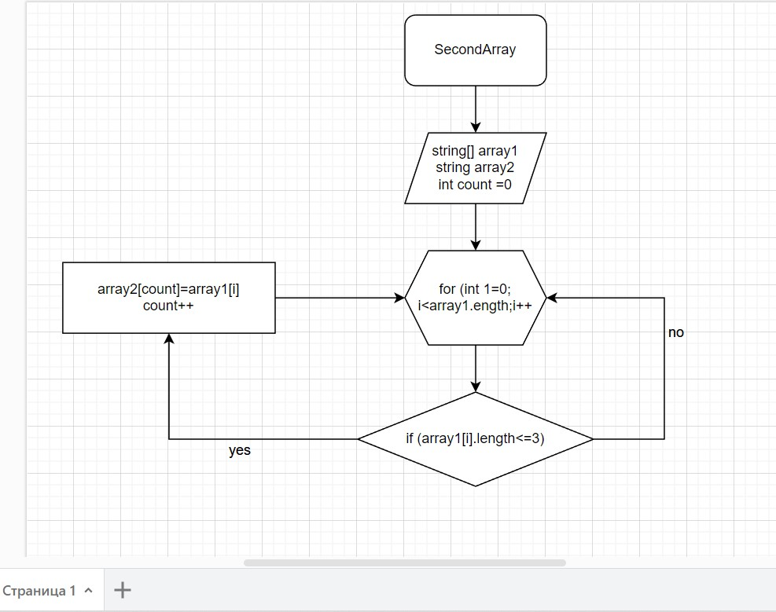

# Решение задачи.
1. Показывает два массива: массив 1 и массив 2.
2. Используем метод, в котором цикл соизмерим длине массива, с условием проверки цикла(<=3), если *"Да"* элемент массива 1 заносится в count элемента массива 2.Переменная count увеличивается на 1 и возращается к циклу (for) в котором i увеличивается на 1.
3. Блок-схема решения задачи. 
.
